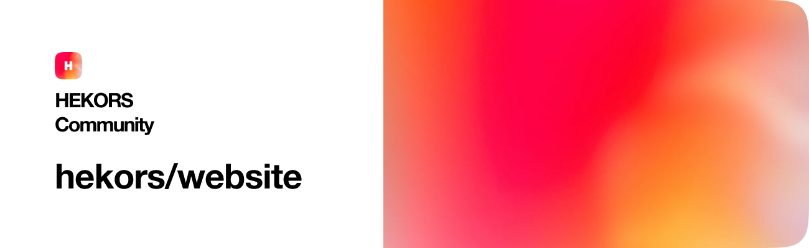

# Community Website

Hey Great People, Welcome to the Community Website Repository 🚀

### Overview

This is the community website repository and it's powered by these technologies:

- Frontend built using [NextJS](http://nextjs.org), [TailwindCSS](http://tailwindcss.com) & [Typescript](http://typescriptlang.org)
- Middleware and API Utilities are written using [Typescript](http://typescriptlang.org)
- For content and information on the website, we're using a headless-CMS called [Strapi](http://strapi.io)

- For design and graphical utilities, we're using [Figma](http://figma.com)

### Requirements

- [Node.js](https://nodejs.org/en/)
- [npm](http://npmjs.com)

### Usage

#### Install Dependencies

To install all dependencies, run this command:

```cmd
npm install --save-dev
```

#### Develop

Launch the development server with the hot reloading functionality that allows any change in files to be immediately visible in the browser. Use this command:

```cmd
npm run dev
```

You can access the live development server at [localhost:3000](https://localhost:3000).

#### Setting up your workspace using GitPod Codespace

In order to prepare and spin up a Gitpod dev environment for our project, we configured our workspace through a [.gitpod.yml](/.gitpod.yml) file.

To spin up a Gitpod codespace, go to [http://gitpod.io/#https://github.com/hekors/website](http://gitpod.io/#https://github.com/hekors/website).

#### Build

To build a production-ready website, run the following command:

```cmd
npm run build
```

Generated files of the website go to the `.next` folder.

